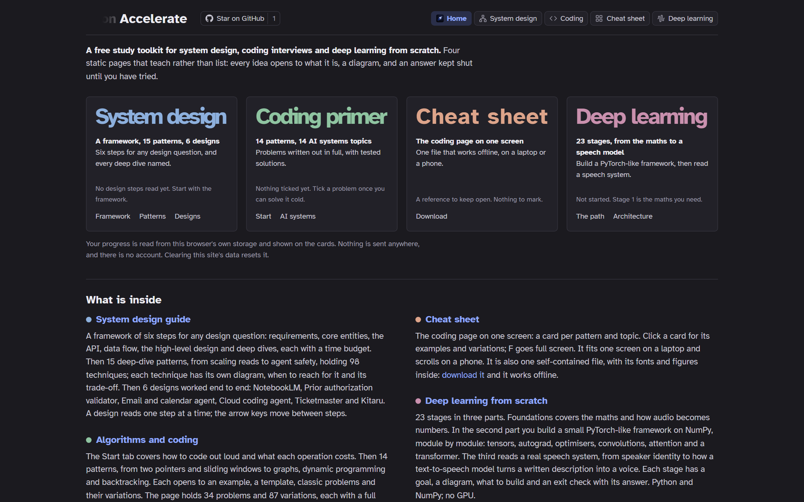

<p align="center">
  
</p>

<h1 align="center">Accelerate</h1>

<p align="center">
  A free study toolkit for system design, coding interviews and deep learning from scratch.<br>
  Static pages that teach rather than list. No account; your progress stays in your browser.
</p>

<p align="center">
  <a href="https://pranavmishra17.github.io/self-study/"></a>
  <a href="https://github.com/PranavMishra17/self-study"></a>
</p>
<p align="center">
  <a href="https://pranavmishra17.github.io/self-study/SYSTEM%20DESIGN.html"></a>
  <a href="https://pranavmishra17.github.io/self-study/CODING.html"></a>
  <a href="https://pranavmishra17.github.io/self-study/CHEATSHEET.html"></a>
  <a href="https://pranavmishra17.github.io/self-study/DEEP-LEARNING.html"></a>
</p>

<p align="center">
  
</p>

---

## What is inside

Every idea opens to what it is, a diagram you can take apart, and an answer kept shut until
you have tried. Nothing is behind a login, and nothing you do is sent anywhere.

### System design

A six-step framework for any design question (requirements, core entities, the API, the data
flow, the high-level design and deep dives, each with a time budget), fifteen deep-dive
patterns holding nearly a hundred techniques, each with its own mechanism diagram, and six
designs worked end to end: NotebookLM, a prior authorisation agent, an email and calendar
agent, a coding agent, Ticketmaster, and an agent-evaluation product. A design reads one step
at a time, with the board, how to get there, what to say, and the follow-ups to expect.

<p align="center"></p>

### Coding primer

Fourteen algorithm patterns, each with how to spot it, a Python template, classic problems
written out in full (two worked examples, constraints, a hint, a tested solution) and
variations of each. An AI systems tab covers the coding that goes beyond interview puzzles:
NumPy and PyTorch basics, embeddings and vector search, RAG over a parser's output, GraphRAG,
an agent loop, a research agent, a voice pipeline, a transformer block, a BPE tokenizer,
evaluating model output, structured output, serving, and LoRA. Every code block runs offline
and is tested.

<p align="center"></p>

### Cheat sheet

The coding primer on one screen: a card per pattern, algorithm and AI topic, each opening to
its examples, variations and code side by side. It fits one screen on a laptop, becomes tiles
on a phone held sideways, and scrolls on a phone held upright. It is also one self-contained
file you can download and use offline.

<p align="center"></p>

### Deep learning from scratch

Twenty-three stages from the maths you need to a speech model: foundations, then building a
small PyTorch-like framework yourself (autograd, layers, optimisers, training), then audio ML
from spectrograms to a text-to-speech system, with the architecture drawn at each step. Each
stage has its goal, what to build, and an exit check with its answer.

<p align="center"></p>

## Diagrams you can take apart

Every diagram on the site opens full screen: hover or tap a part for a one-line note, click it
for the explanation, and walk through the flow one step at a time.

<p align="center"></p>
<p align="center"></p>
<p align="center"></p>

## How to use it

- **Start with the framework** in the system design guide, then read one worked design a
  week, one step at a time, out loud.
- **Pick one coding pattern** a session: read how to spot it, try the classic problems before
  opening the solutions, then the variations. Keep the cheat sheet open while you practise.
- **Follow the deep learning path in order.** Each stage builds on the last.
- **Mark your progress** as you go: steps you have read, problems you have solved, stages you
  have finished. It is kept in your browser's storage on this device only. Clearing the
  site's data resets it.
- **Put your name on it.** Click the faint name before "Accelerate" on the home page.

Every diagram can be explored: click one for a full-screen view, hover or tap a part for a
one-line note, and step through it with "walk through".

## Run it yourself

Everything is static HTML. To build and serve the public site locally:

```bash
python tools/build_public.py                  # writes _site/ and checks it
python -m http.server 8000 --directory _site  # then open http://localhost:8000
```

The published site is built by a GitHub Actions workflow (`.github/workflows/pages.yml`) on
every push to `main`: `tools/build_public.py` copies an allowlist of pages and the files they
load, and fails the build if anything outside that list slips in. The design rules every page
follows are in [`DESIGN.md`](DESIGN.md).

If the toolkit helps you, a star on the repository is the nicest thanks.

## Credits

- Icons: [Lucide](https://lucide.dev) (ISC), bundled in `figures/icons.js`.
- Typefaces: Atkinson Hyperlegible and JetBrains Mono (SIL Open Font License), bundled in `fonts/`.
- Reading draws on *Designing Data-Intensive Applications* (2nd edition) and
  [AI Engineering from Scratch](https://aiengineeringfromscratch.com).
