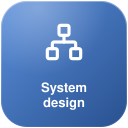
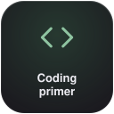
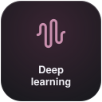
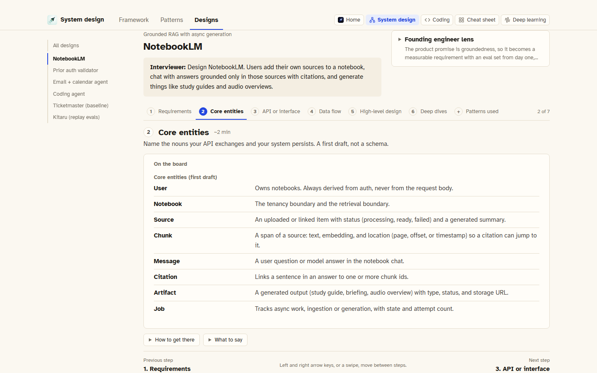
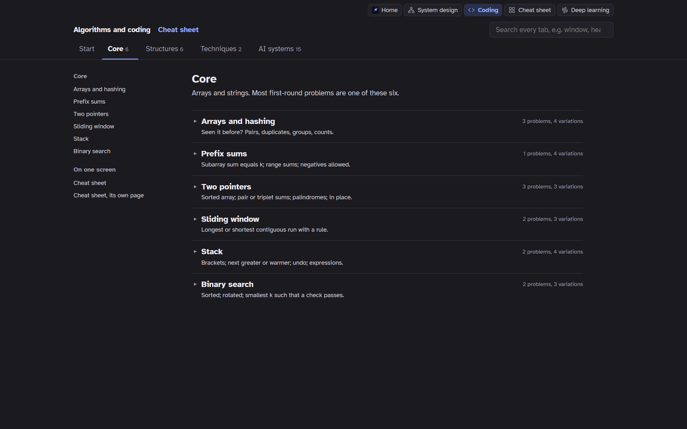
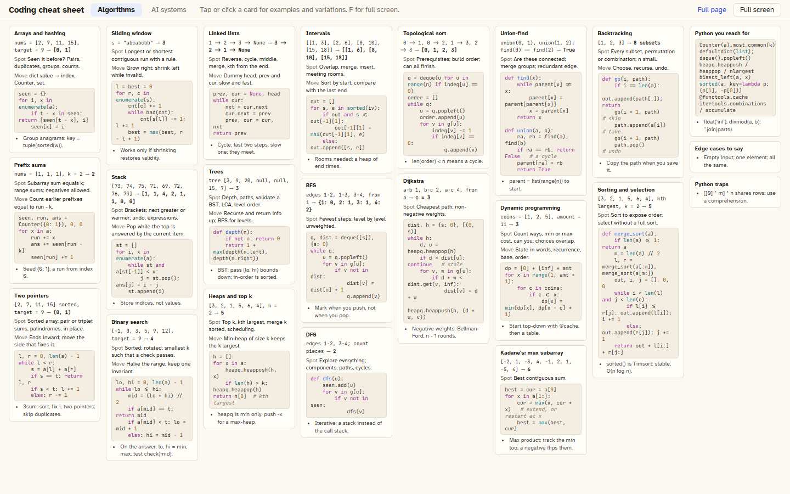
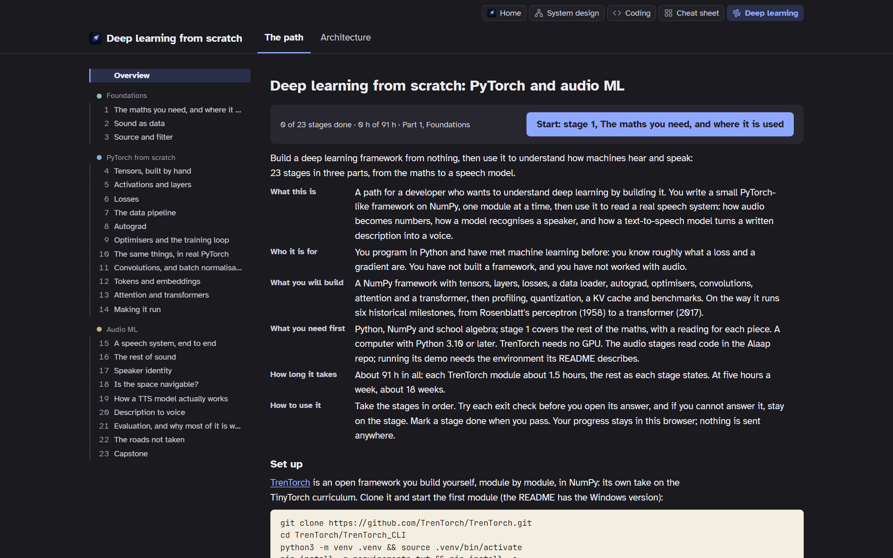
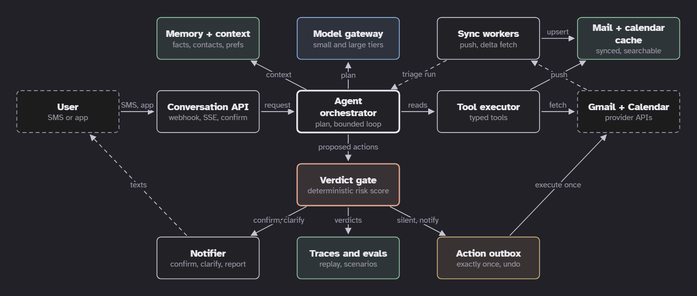
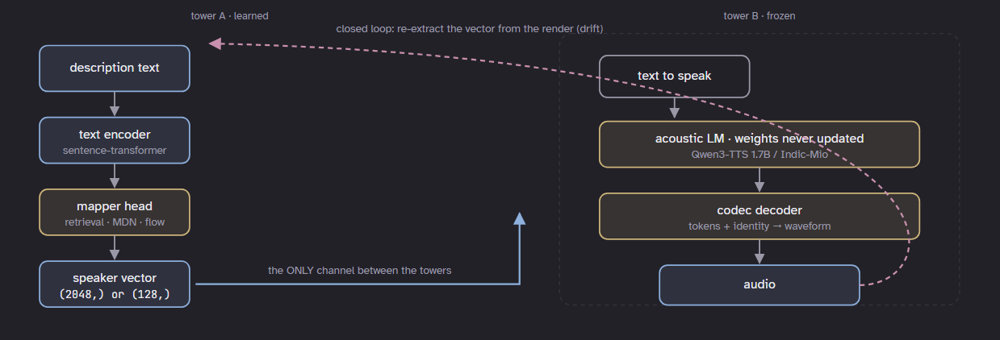
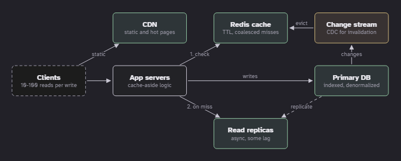

<h1 align="center"> accelerate-anon</h1>

---

<p align="center">
  A free study toolkit for system design, coding interviews and deep learning from scratch.<br>
  Static pages that teach rather than list. No account; your progress stays in your browser.
</p>

<p align="center">
  <a href="https://pranavmishra17.github.io/accelerate-anon/"></a>
  <a href="https://github.com/PranavMishra17/accelerate-anon"></a>
</p>

---

<p align="center">
  <a href="https://pranavmishra17.github.io/accelerate-anon/SYSTEM%20DESIGN.html"></a>
  <a href="https://pranavmishra17.github.io/accelerate-anon/CODING.html"></a>
  <a href="https://pranavmishra17.github.io/accelerate-anon/CHEATSHEET.html"></a>
  <a href="https://pranavmishra17.github.io/accelerate-anon/DEEP-LEARNING.html"></a>
</p>

## What is inside

Every idea opens to what it is, a diagram you can take apart, and an answer kept shut until
you have tried. Nothing is behind a login, and nothing you do is sent anywhere.

### System design

A six-step framework for any design question (requirements, core entities, the API, the data
flow, the high-level design and deep dives, each with a time budget), fifteen deep-dive
patterns holding nearly a hundred techniques, each with its own mechanism diagram, and six
designs worked end to end: NotebookLM, a prior authorisation agent, an email and calendar
agent, a coding agent, Ticketmaster, and an agent-evaluation product. A design reads one step
at a time, with the board, how to get there, what to say, and the follow-ups to expect.

<p align="center"></p>

### Coding primer

Fourteen algorithm patterns, each with how to spot it, a Python template, classic problems
written out in full (two worked examples, constraints, a hint, a tested solution) and
variations of each. An AI systems tab covers the coding that goes beyond interview puzzles:
NumPy and PyTorch basics, embeddings and vector search, RAG over a parser's output, GraphRAG,
an agent loop, a research agent, a voice pipeline, a transformer block, a BPE tokenizer,
evaluating model output, structured output, serving, and LoRA. Every code block runs offline
and is tested.

<p align="center"></p>

### Cheat sheet

The coding primer on one screen: a card per pattern, algorithm and AI topic, each opening to
its examples, variations and code side by side. It fits one screen on a laptop, becomes tiles
on a phone held sideways, and scrolls on a phone held upright. It is also one self-contained
file you can download and use offline.

<p align="center"></p>

### Deep learning from scratch

Twenty-three stages from the maths you need to a speech model: foundations, then building a
small PyTorch-like framework yourself (autograd, layers, optimisers, training), then audio ML
from spectrograms to a text-to-speech system, with the architecture drawn at each step. Each
stage has its goal, what to build, and an exit check with its answer.

<p align="center"></p>

## Diagrams you can take apart

Every diagram on the site opens full screen: hover or tap a part for a one-line note, click it
for the explanation, and walk through the flow one step at a time.

<p align="center"></p>
<p align="center"></p>
<p align="center"></p>

## How to use it

- **Start with the framework** in the system design guide, then read one worked design a
  week, one step at a time, out loud.
- **Pick one coding pattern** a session: read how to spot it, try the classic problems before
  opening the solutions, then the variations. Keep the cheat sheet open while you practise.
- **Follow the deep learning path in order.** Each stage builds on the last.
- **Mark your progress** as you go: steps you have read, problems you have solved, stages you
  have finished. It is kept in your browser's storage on this device only. Clearing the
  site's data resets it.
- **Put your name on it.** Click the faint name before "Accelerate" on the home page.

Every diagram can be explored: click one for a full-screen view, hover or tap a part for a
one-line note, and step through it with "walk through".

## Use it with an agent

The whole toolkit is plain data in plain files, so a coding agent (Claude Code, Codex, Cursor,
or any other) can study with you from it, quiz you, and extend it. Clone it and open the folder
in your agent:

```bash
git clone https://github.com/PranavMishra17/accelerate-anon.git
cd accelerate-anon
```

Then paste this to get going:

```text
You are my study partner for this repository, Accelerate. Read README.md and DESIGN.md first.
The material is data: the coding patterns, problems, variations and AI systems topics are in
coding/data.js; the system design framework, patterns and worked designs are the GUIDE object
in "SYSTEM DESIGN.html"; the deep learning path is alaap/plan.py.

1. Ask what I am preparing for and how much time I have each week, then propose a plan built
   from these pages, with links to the exact sections.
2. Quiz me one open question at a time from the material. Never show the answer until I try.
3. When I miss something, point me to the section to reread and quiz me on it again later.
4. If I ask for more, add problems, variations or topics in the same shape as the existing
   ones, then run `python coding/test_data.py` so every code block still runs.

Keep your replies short, and name the page and section you are drawing on.
```

Tune it to your liking: change the pace, narrow it to one page ("only the system design
patterns"), ask for mock interviews in the style of the worked designs, or skip the prompt
and point your agent at a single file when you want a quick answer. The design rules in
`DESIGN.md` keep anything it adds consistent with the rest.

## Run it yourself

Everything is static HTML. To build and serve the public site locally:

```bash
python tools/build_public.py                  # writes _site/ and checks it
python -m http.server 8000 --directory _site  # then open http://localhost:8000
```

The published site is built by a GitHub Actions workflow (`.github/workflows/pages.yml`) on
every push to `main`: `tools/build_public.py` copies an allowlist of pages and the files they
load, and fails the build if anything outside that list slips in. The design rules every page
follows are in [`DESIGN.md`](DESIGN.md).

If the toolkit helps you, a star on the repository is the nicest thanks.

## Credits

This toolkit stands on other people's work. The ones it leans on most:

| Source | By | Used for |
|---|---|---|
| [System Design in a Hurry: Delivery Framework](https://www.hellointerview.com/learn/system-design/in-a-hurry/delivery) and [common patterns](https://www.hellointerview.com/learn/system-design/in-a-hurry/patterns) | Hello Interview | The system design guide's six steps, their timings, and the core deep-dive patterns |
| [Designing Data-Intensive Applications, 2nd edition](https://dataintensive.net/) | Martin Kleppmann and Chris Riccomini | Background reading behind the system design material |
| [AI Engineering from Scratch](https://aiengineeringfromscratch.com/) | Rohit Ghumare | Lessons linked from the diagrams and the deep learning path |
| [TinyTorch](https://mlsysbook.ai/tinytorch/) | Vijay Janapa Reddi and the ML Systems Book community | The curriculum behind the deep learning path's build stages |
| [TrenTorch](https://github.com/TrenTorch/TrenTorch) | TrenTorch | The framework the deep learning path builds module by module |
| [Alaap](https://github.com/PranavMishra17/alaap) | The author of this toolkit | The voice design system the deep learning path's audio stages read |
| [LeetCode](https://leetcode.com/problemset/), [Blind 75](https://www.teamblind.com/post/New-Year-Gift---Curated-List-of-Top-75-LeetCode-Questions-to-Save-Your-Time-OaM1orEU), [NeetCode 150](https://neetcode.io/practice) | Their authors | Where the classic problems are known from; every statement, example and solution here is written fresh |
| [Lucide](https://lucide.dev/) | Lucide Contributors (ISC) | The icons in the diagrams and on this page |
| [Atkinson Hyperlegible](https://www.brailleinstitute.org/freefont/) and [JetBrains Mono](https://github.com/JetBrains/JetBrainsMono) | Braille Institute; JetBrains (SIL OFL 1.1) | The text and code typefaces |
| [Playwright](https://playwright.dev/python/), [Shields.io](https://shields.io/), [GitHub Pages](https://docs.github.com/en/pages) | Microsoft; Shields.io; GitHub | Screenshots, badges and hosting |

The full list, with every paper and article the pages link to, grouped by page, and the
licence of each asset and tool, is in **[CREDITS.md](CREDITS.md)**. If something of yours is used
here and is missing or credited wrongly, open an issue and it will be fixed.
